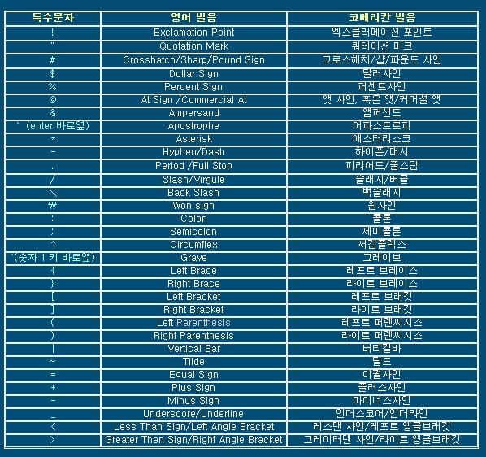

- #git-bash 명령어 익히기

  ##기초 명령어

  - 폴더경로
  - 생성/삭제
  - 기타

  ###폴더 경로
  >폴더의 위치를 파악하고 원하는 곳으로 이동
  >
  1. **pwd**:현재열려있는 경로상태
  2. **cd ..**:현재위치에서 상위폴더 이동
  3. **cd ~**:시스템이 설정되어진 최상위폴더
  4. **cd**: 현위치에서 존재하는 폴더 이동
  5. **cd 폴더/하위폴더**: 현위치에서 존재하고있는 폴더에서 하위에있는 폴더로 이동

  ---
  ###생성/삭제
  > 현재 폴더에서 필요한 폴더 및 파일을 생성시키는 방법과, 삭제하는 방법

  1. **mkdir**:폴더생성
  2. **touch**:파일생성
  3. **rm -r**:삭제(폴더,파일) (-r 강제삭제)

  ###기타
  > 기타 bash명령어

  1. **clear**:화면정리
  2. **ls**:현재폴더위치에 폴더/파일을 목록으로 보여주는기능
  3. **&&**: 두가지 이상의 기능을 사용할때 중간에 연결기능
     `mkdir testBox && touch testBox/mkfile.md`

      ```
      ㅇㄹㅇㄹ
      ㅇㄹㅇㄹ
      ```

##tip: 키보드 명칭체크



